# GSPro: полное руководство по сайту

Редакция: 27 сентября 2026 года. Сайт: https://gspro.store. Для покупателя, менеджера, оператора и владельца.

Текст сверён с исходниками, прочитанными с действующего VPS 27.09.2026. Это проверка реализации, а не протокол выполнения реальных покупок, рассылок или удаления данных. Сайт параллельно дорабатывается; раздел «Версия и проверка» фиксирует границы этой редакции. Иллюстрации административной части сделаны 26.09.2026 на синтетических данных; новые функции объяснены в тексте.

## 1. Главная, меню и каталог

Откройте главную страницу. Верхнее меню даёт доступ к поиску, выбору языка RU/EN, профилю и поддержке. Карусель показывает включённые акции; кнопка слайда ведёт по настроенной ссылке. Содержание рекламного блока задаётся администратором.

1. Найдите игру по названию в поиске. Поиск каталога учитывает исходное и локализованное название.
2. Выберите фильтр «Все», Mobile, PC или другую платформу из доступных. Если ничего не найдено, очистите запрос и верните «Все».
3. Откройте карточку игры. Покупателю доступны только активные предложения; скрытая игра не становится доступной от очистки фильтра.
4. Для прямого перехода используйте страницу `/games/адрес-игры`. Проверяйте название и платформу перед покупкой.
5. Контакты, документы и настройки cookie находятся также в нижней части сайта. Страница `/gspro` содержит публичную информацию проекта.

## 2. Игра, наборы и своё количество

1. Прочитайте шаги пополнения, описание и требования к игровому аккаунту.
2. Выберите готовый набор, посмотрите его состав и количество наборов. Если включено «Своё количество», задайте число в разрешённых границах с указанным шагом.
3. Проверьте итог и перейдите к оформлению. Данные каталога могут обновляться: окончательная проверка цены и лимитов выполняется сервером.
4. Посмотрите отзывы об игре. Отзыв привязан к покупке; его наличие не заменяет проверку выбранного товара.

## 3. Регистрация, вход и восстановление

1. В меню профиля выберите регистрацию, укажите свою почту и пароль по требованиям формы. Подтвердите адрес кодом из письма.
2. Для входа используйте зарегистрированную почту и пароль. Если включена 2FA, введите код приложения или неиспользованный резервный код.
3. При потере пароля откройте `/auth/recovery` и следуйте шагам подтверждения почты. При включённой 2FA понадобится также второй фактор; доступ к почте не отменяет эту проверку.
4. Если письмо не пришло, проверьте правильность адреса и папку спама. Не передавайте почтовый пароль или коды поддержке.
5. У сотрудника административные функции появятся после принятия приглашения, подключения 2FA и выдачи нужного канала доступа.

## 4. Оформление и оплата

1. Войдите в свой аккаунт. На `/checkout` проверьте email, игру, набор, количество и состав. Почта заказа берётся из аккаунта.
2. Заполните требуемые данные игры: UID, логин и/или игровой пароль. Не вводите вместо них пароль почты или GSPro; не отправляйте игровые пароли в переписку.
3. Если есть промокод, введите его и нажмите «Применить». Дождитесь пересчитанной суммы: набранный, но неприменённый код скидку не даёт.
4. Прочитайте документы по ссылкам и дайте отдельные обязательные подтверждения. Необязательная подписка не определяет возможность покупки.
5. Проверьте «Итого перед оплатой» и уведомление о комиссии провайдера. Перейдите к оплате; реквизиты карты вводятся на странице платёжного провайдера.
6. После возврата откройте заказ в личном кабинете. Страница `/order/success` и возврат браузера сами по себе не подтверждают оплату: нужен подтверждённый сервером статус.
7. Если заказ создан, но ссылка временно недоступна, откройте этот заказ в кабинете и используйте доступное действие оплаты. При списании без обновления статуса обратитесь в поддержку с номером заказа, не создавайте повторное списание вслепую.
8. «Приём платежей приостановлен» означает ограничение новых оплат. Уже начатые платежи продолжают проверяться. При блокировке покупок своего профиля обратитесь в поддержку через сохранённую историю.

## 5. Личный кабинет: заказы, чат и отзывы

1. Откройте `/account` -> «Заказы». В списке показаны номер, игра, состав и статус. Выберите заказ, чтобы открыть связанную переписку.
2. Общайтесь по конкретному заказу. Не включайте в сообщение игровые пароли, банковские реквизиты и одноразовые коды.
3. Для неоплаченного заказа может быть доступно «Отменить и убрать из списка». Подтвердите отмену и больше не оплачивайте старую ссылку. Если деньги уже списались, сначала обратитесь в поддержку.
4. Статусы различают ожидание оплаты, оплату, исполнение, завершение, отмену и возврат. Назначение статуса сотрудником не выполняет банковский возврат автоматически.
5. Кнопка «Оставить отзыв» доступна для оплаченного, выполняемого или завершённого заказа, если отзыва ещё нет. Удалённый модератором отзыв отмечается в карточке.
6. Колокольчик показывает уведомления аккаунта. Настройки писем находятся в профиле; отключение письма не отменяет сам заказ и сообщения в кабинете.

## 6. Профиль, уведомления и удаление

1. Откройте «Профиль и данные». Здесь доступны смена пароля, 2FA, резервные коды и почтовые предпочтения.
2. Для покупателя 2FA необязательна, для административного доступа обязательна. При подключении подтвердите текущие данные по форме, добавьте QR-код или ключ в TOTP-приложение и подтвердите код.
3. Сохраните выданные резервные коды отдельно от пароля. Они показываются при выдаче; каждый применяется один раз. Обновление делает прежние коды недействительными.
4. При включённой 2FA смена пароля требует второй фактор. Отключение 2FA требует текущий пароль и код из письма; завершает прежние сессии и отключает старые резервные коды.
5. Настройте доступные категории писем и сохраните. У сотрудников подписки на заказы и чат зависят от прав. У владельца есть отдельная подписка на отчёты о резервных копиях.
6. Кнопка «Запросить удаление» завершает сессии и начинает ожидание 72 часов. Успешный вход в этот срок отменяет запрос. После срока вход закрывается; окончательное обезличивание требует отдельного действия уполномоченного сотрудника, права изменения аккаунтов, подтверждения паролем и 2FA, отсутствия активных заказов и несверенных платежей.
7. Окончательно обезличенный аккаунт нельзя восстановить кнопкой отмены запроса. Необходимые записи о платежах и незавершённых обязательствах обрабатываются отдельно.

## 7. Поддержка, документы и cookie

Откройте `/support`, выберите опубликованный способ связи либо заполните форму: email, номер заказа при наличии, тема и сообщение. Подтвердите отдельное согласие на обработку обращения, нажмите «Отправить обращение» и сохраните выданный номер. Каналы в поддержке могут отличаться от контактов в подвале: они настраиваются отдельно.

Юридические тексты доступны по `/legal/адрес-документа` и ссылкам оформления. При сохранении новой редакции администратором прежняя версия согласий заказа сохраняется. Изменение текста в админке не заменяет согласование содержания владельцем.

В настройках cookie проверьте выбранные категории. Отклонение необязательных категорий не является выходом из аккаунта; завершение сессии выполняется через меню профиля.

## 8. Установка веб-приложения на телефон

Откройте https://gspro.store в браузере телефона и используйте его команду установки или добавления на главный экран. Наличие и название команды зависят от браузера. На iPhone используется меню «Поделиться» Safari и «На экран Домой»; на Android - меню поддерживающего установку браузера.

Это та же веб-версия магазина с общей историей и аккаунтом. Требуется интернет; отдельного APK, офлайн-режима и push-уведомлений в проверенном коде нет. Telegram Mini App ниже предназначена для администрирования и открывается внутри Telegram.

## 9. Веб-админка и Telegram Mini App

Редакция текста: 27 сентября 2026 года. Сверено с копией исходников действующего VPS. Снимки интерфейса ниже относятся к 26 сентября 2026 года и служат ориентиром: новые поля и кнопки описаны в тексте. Все снимки сделаны в изолированной тестовой среде со **синтетическими** аккаунтами, заказами, адресами и UID. Для демонстрации формы окончательного удаления истёкший срок запроса смоделирован только в тестовом браузере. Действия, отправляющие реальные письма или платежи, при подготовке не выполнялись.

### Доступ и сохранение изменений

Откройте профиль на сайте и выберите «Админка». Сотруднику нужны приглашение, подтверждённая почта и включённая 2FA. Доступные вкладки определяет роль. В Mini App дополнительно нужна подтверждённая привязка Telegram. Значения в снимках (`example.test`, `QA-*`) учебные.

Кнопка «Сохранить» относится к текущей форме или вкладке. Если раздел доступен только для чтения, поля и действия изменения отключены. Для заказов, оплаты, идентификаторов, паролей и удаления существуют отдельные права.

### Разделы и действия

### Каталог игр

#### Главная панель и переходы

Панель показывает только разделы, разрешённые текущей роли.

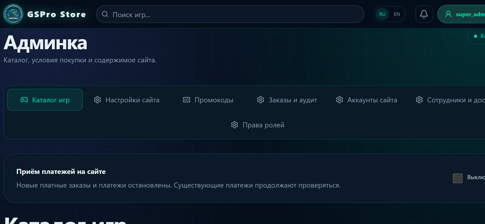
1. Откройте «Админка» из меню профиля; выберите вкладку в верхней панели.
2. В «Каталоге игр» используйте поле «Поиск игр»: название, адрес игры или издатель. Регистр не важен; очистка строки возвращает список. Для неактивных игр включите «Показать скрытые».
3. Кнопки редактирования доступны только при праве изменения каталога.

#### Приём платежей на сайте

Переключатель расположен над карточками каталога и управляет созданием новых платных заказов.

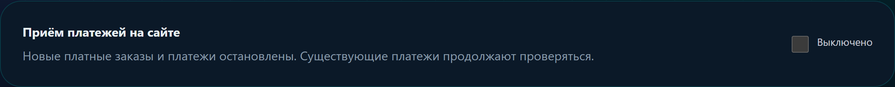
1. Измените переключатель и проверьте, какое действие предлагает форма: включение или отключение.
2. Введите свой код 2FA администратора либо одноразовый резервный код и нажмите «Подтвердить». Вводимые символы видны. «Отмена» закрывает форму без переключения.
3. Дождитесь нового состояния и сообщения сервера. Ошибка или простой щелчок по галочке не означают сохранения. Отключение останавливает новые платные заказы и платежи; уже начатые платежи продолжают проверяться.
4. Включение доступно при настроенных ключах и HTTPS-адресе провайдера. Для изменения нужно отдельное право на приём платежей; чтение не даёт возможности переключать.

#### Карточка игры

Редактор открывается из карточки игры и объединяет каталог, оформление и товары.

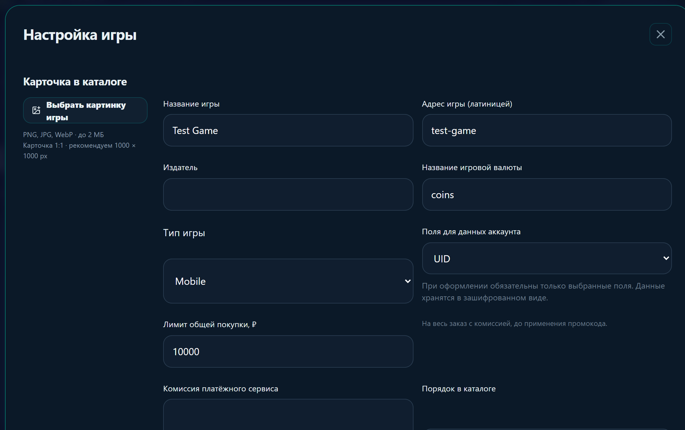
1. Укажите название, латинский адрес, издателя, тип игры и валюту.
2. Выберите обязательные поля: UID, только логин, только пароль, UID + логин, UID + пароль, логин и пароль либо UID + логин и пароль. Покупатель заполняет только выбранный набор полей; значения хранятся зашифрованными.
3. Проверьте лимит общей покупки в рублях (с комиссией, до промокода), порядок и видимость. Для собственного количества проверьте минимум, максимум, шаг, курс и процент комиссии. Текст «Комиссия платёжного сервиса» сам по себе цену не меняет; при пустом поле оформление показывает стандартное уведомление Platega.
4. Настройте изображение и его кадрирование. После сохранения повторно откройте игру: значения должны сохраниться, а активная карточка - появиться в каталоге.

#### Шаги пополнения

Шаги показывают покупателю последовательность оформления.

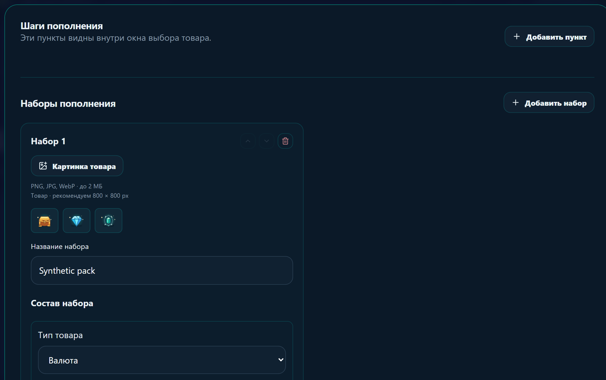
1. Добавьте понятные названия и пояснения шагов.
2. Кнопками со стрелками переставьте шаги, удалите устаревшие.
3. Сохраните игру и проверьте её публичную страницу.

#### Наборы пополнения

Каждый набор задаёт товар, цену и содержимое предложения.

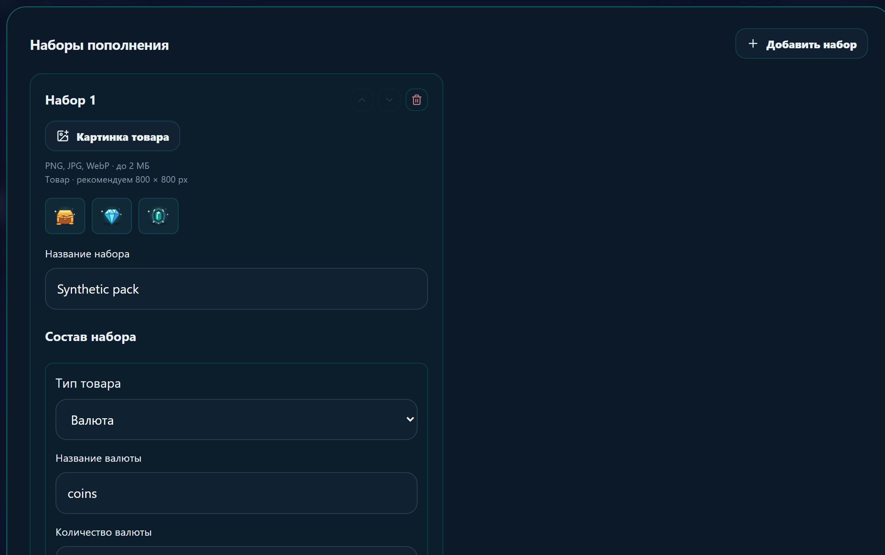
1. Добавьте набор, название и состав; проверьте цену и порядок.
2. При необходимости измените видимость товара.
3. При необходимости включите «Своё количество», задайте границы, шаг, курс и комиссию. Для готового набора проверьте количество покупаемых наборов и итоговую цену.
4. Сохраните игру после всех изменений и проверьте набор и состав в публичном оформлении.

### Настройки сайта

#### Контакты проекта

Эти публичные контакты используются на сайте; личные данные владельца сюда не вносят.

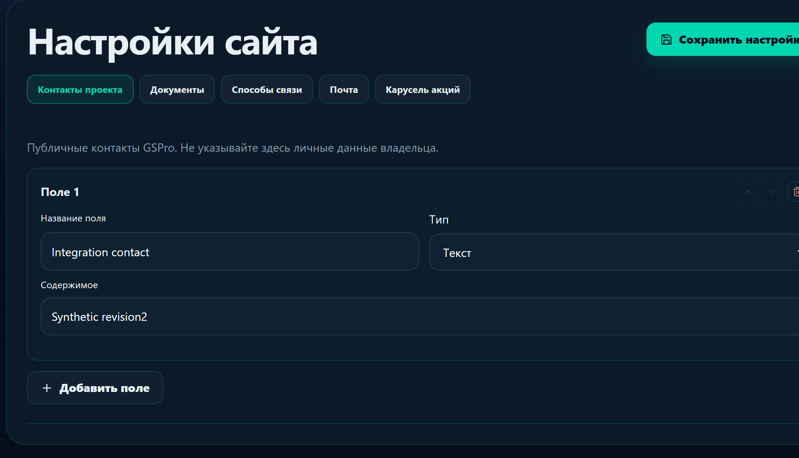
1. Добавьте поле, выберите тип: текст, email, телефон или ссылка.
2. Заполните значение и при необходимости текст ссылки.
3. Переместите поля в нужном порядке и нажмите «Сохранить настройки».

#### Документы

Вкладка управляет текстами и редакциями публичных юридических документов.

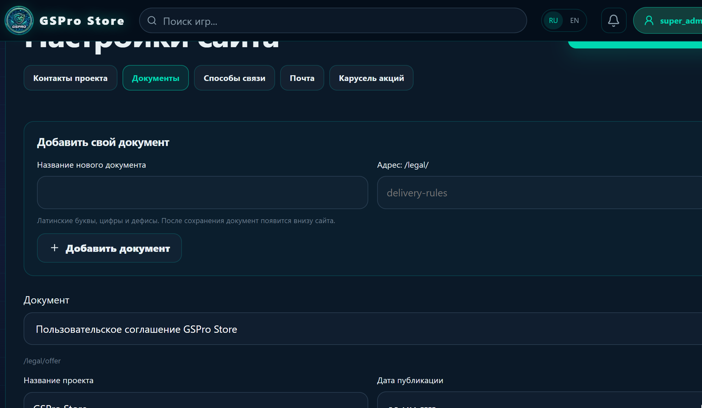
1. Выберите существующий документ или задайте название и свободный адрес /legal/ для нового.
2. Укажите дату публикации, описание и разделы; порядок разделов меняется стрелками.
3. Сохранение создаёт новую редакцию; принятые в заказах версии сохраняются.

#### Способы связи

Контакты страницы поддержки настраиваются отдельно от контактов в подвале.

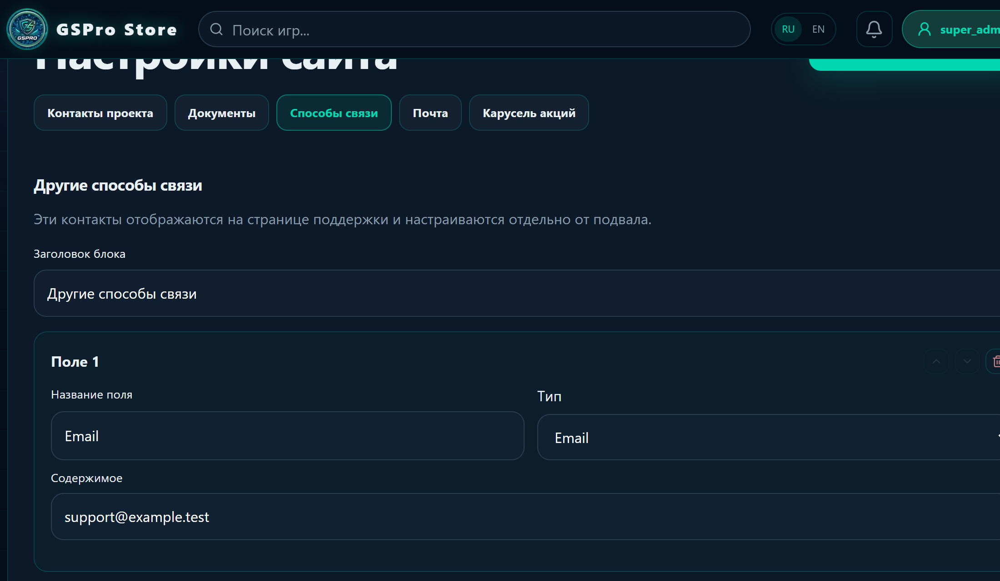
1. Измените заголовок блока.
2. Добавьте поля нужного типа и проверьте ссылки.
3. Сохраните настройки и откройте публичную страницу поддержки.

#### Почта по задачам

Для восстановления, рассылок, заказов и поддержки предусмотрены отдельные SMTP-профили.

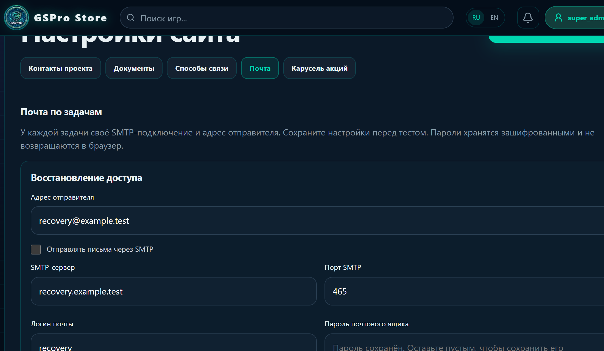
1. Укажите адрес отправителя, сервер, порт и логин для каждой задачи.
2. Пароль вводится отдельно; сохранённый пароль обратно в браузер не возвращается.
3. Сначала сохраните настройки, затем при необходимости отправьте тестовое письмо.

#### Карусель акций

Первый активный слайд появляется при загрузке главной страницы.

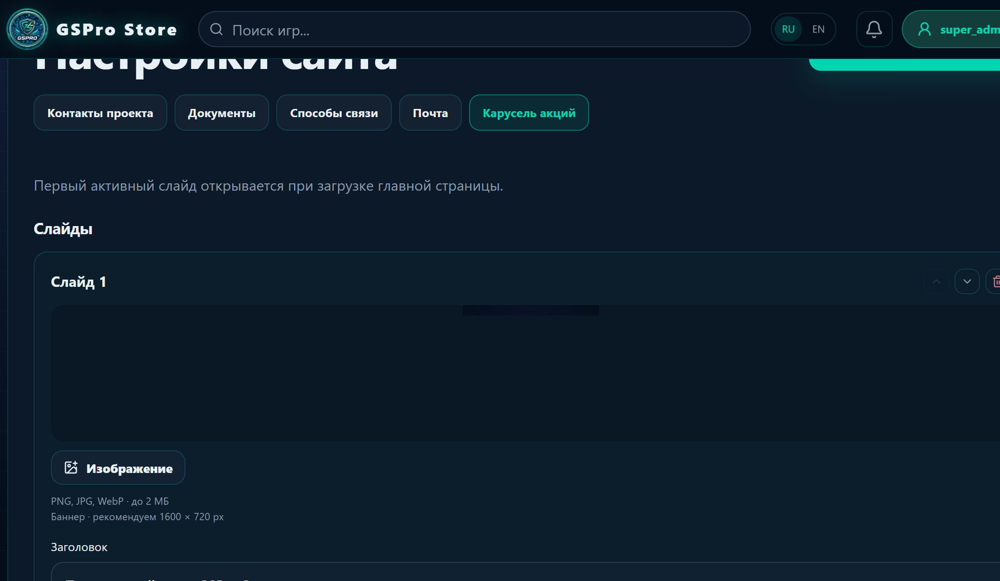
1. Для слайда задайте изображение, заголовок, описание, метку и ссылку кнопки.
2. Кнопкой «Добавить подпись» добавляйте короткие пункты; рядом находится «Удалить подпись». На телефоне поле подписи помещается в карточке слайда. Стрелками меняйте порядок слайдов; проверьте галочку «Слайд включён».
3. Сохраните настройки и проверьте главную страницу.

### Язык редактируемого текста: RU / EN

Это вкладки содержимого формы, отдельные от переключателя языка интерфейса сайта.

1. Откройте игру или одну из вкладок настроек: контакты, документы, способы связи, карусель акций.
2. В блоке «Язык текста» выберите RU и заполните оригинал. Затем выберите EN и заполните английские значения тех же полей.
3. В режиме EN включите «Показать оригинал» для сопоставления. Если отдельная запись EN не задана, используется словарь или русский текст. Сохранённое пустое поле EN может убрать текст в английской версии; не стирайте перевод ради возврата к RU. Некоторые известные фразы могут подставляться из словаря автоматически.
4. Метки «Нет перевода», «Проверить перевод» и «EN готов» помогают проверить заполнение. После изменения RU проверьте старый EN; кнопка «Подтвердить перевод» отмечает проверенное значение, затем всё равно сохраните форму.
5. Нажмите кнопку сохранения игры или соответствующих настроек: она записывает RU и EN вместе. Простое переключение вкладок не публикует текст.
6. Изображения, цены, количество, включение элементов и технический адрес игры общие. Ссылки в шагах, слайдах и контактах могут иметь языковой вариант: откройте обе версии ссылки после сохранения.
7. На публичном сайте проверьте RU -> EN -> RU для карточки, наборов, шагов, контактов, документов и слайдов. Административные команды, сообщения API и письма имеют отдельную локализацию.

### Контроль игровых аккаунтов и блокировка покупок

1. Откройте «Аккаунты сайта», найдите покупателя по email или ID и проверьте «Контроль покупок».
2. Метка «3+ игровых аккаунта за 90 дней» появляется по оплаченным нетестовым заказам в одной игре. UID и логины считаются раздельно; пара UID + логин не считается двумя аккаунтами. Регистр и пробелы нормализуются.
3. Раскройте «Игры, UID и логины». Просмотр идентификаторов требует отдельного права. Без него сотрудник видит ограничения и количества, но не значения UID и логинов.
4. Чтобы вручную остановить покупки, выберите «Заблокировать покупки», введите причину (3-500 символов) и подтвердите. Для снятия используйте «Разблокировать покупки» с новой причиной. Действие доступно при праве изменения аккаунтов и только для необезличенного покупателя.
5. Блокировка действует на новые заказы и оплату во всех играх. Вход, история заказов и поддержка сохраняются. Изменение фиксируется; уведомления об ограничении предусмотрены для покупателя и ответственных сотрудников, доставка зависит от почты и обработки очереди.
6. Попытка добавить новый пятый UID либо логин в одной игре за 90 дней вызывает автоматическую блокировку. Повтор известного идентификатора сам по себе счётчик не увеличивает. Если предел заняли незавершённые оплаты, возможен временный отказ с просьбой дождаться их завершения или подтверждённой отмены.
7. Снятие блока не очищает историю 90 дней и не отменяет контроль: новая попытка за пределом может снова заблокировать покупки. Сначала выясните причину и проверьте историю.

### Промокоды

#### Одноразовые промокоды

Код может быть использован только один раз на весь сайт.

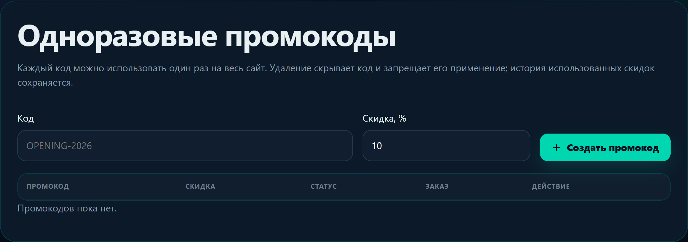
1. Введите код и скидку в процентах, нажмите «Создать промокод».
2. Таблица показывает статус и связанный заказ.
3. Удаление скрывает код и запрещает новое применение; история скидки остаётся.

### Заказы и аудит

#### Сводка и поиск заказов

Вкладка показывает общее число заказов, ожидающие и находящиеся в работе.

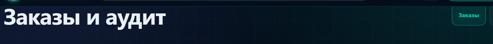
1. Ищите заказ по номеру или email.
2. Выберите «Заказы» либо «Аудит».
3. Права роли определяют, какие действия видны и доступны.

#### Таблица заказов

В строке видны игра, контакт, сумма, статус и доступные действия.

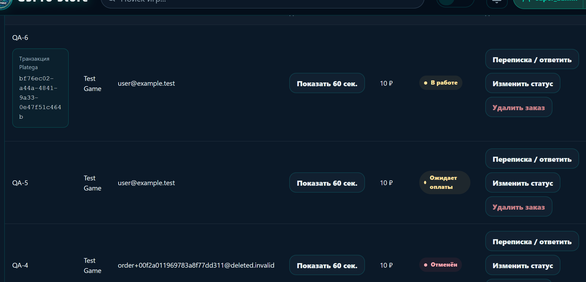
1. Откройте переписку для ответа покупателю.
2. Используйте «Изменить статус» для учёта этапа выполнения.
3. Данные аккаунта раскрываются отдельно на ограниченное время.

#### Изменить статус

Статус GSPro не списывает деньги и сам по себе не делает возврат через провайдера.

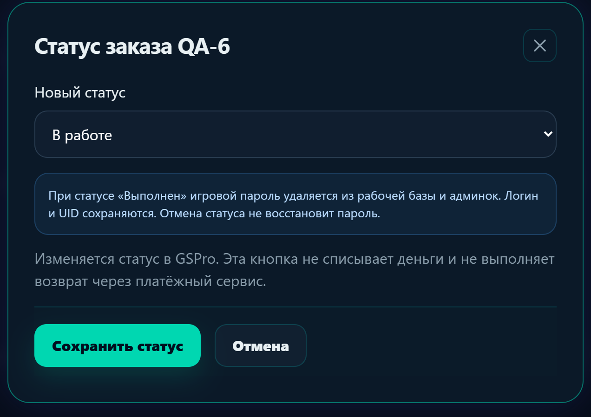
1. Выберите новый статус и проверьте предупреждение.
2. При «Выполнен» игровой пароль удаляется из рабочей базы и админок; отмена статуса его не вернёт.
3. Нажмите «Сохранить статус» только после фактического выполнения действия.

#### Переписка с покупателем

Сообщения привязаны к конкретному заказу и видны в истории переписки.

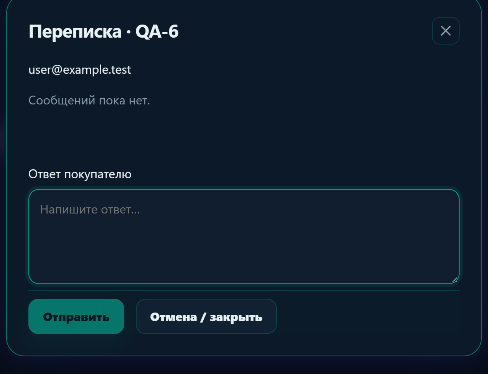
1. Откройте «Переписка / ответить» в нужной строке.
2. Прочитайте историю и введите ответ в поле сообщения.
3. Отправка создаёт новое сообщение; письмо покупателю зависит от его подписки и почтовых настроек.

#### UID, логин и пароль

Поля раскрываются на 60 секунд и скрываются после таймера.

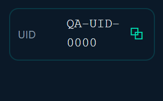
1. Нажмите «Показать 60 сек.»; доступ к идентификаторам и паролям назначается раздельно.
2. Нажмите на конкретное поле для копирования; короткое уведомление не показывает значение.
3. Без отдельного права просмотра игровых паролей пароль недоступен; у оператора чата этого права нет по умолчанию. У завершённого заказа пароль удалён.

#### Удаление заказа

Удаление убирает заказ с сайта вместе с перепиской и отзывом, но не возвращает оплату.

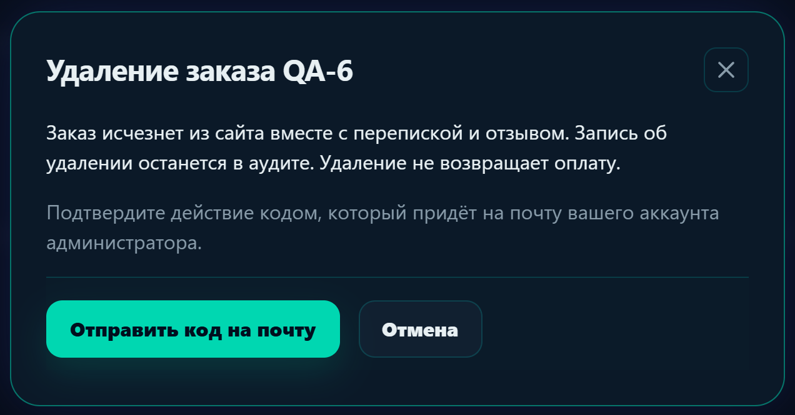
1. Кнопка доступна только роли с правом удаления заказов.
2. Запросите код подтверждения на почту администратора и подтвердите действие.
3. Запись о действии остаётся в аудите. На снимке показан первый шаг без отправки кода.

#### Журнал аудита

Журнал позволяет проверить, кто и когда выполнил административное действие.

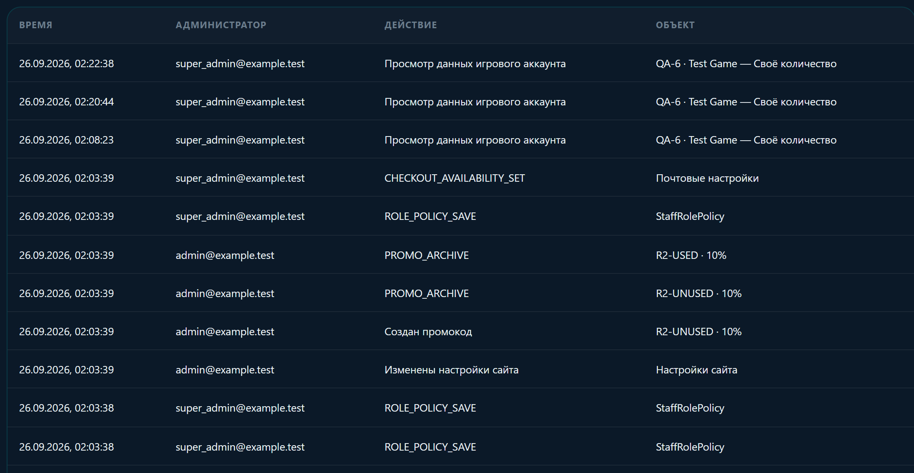
1. Переключитесь на «Аудит» рядом с вкладкой заказов.
2. Сопоставьте время, администратора, действие и объект.
3. Раскрытия данных и другие чувствительные операции фиксируются отдельно.

### Аккаунты сайта

#### Список аккаунтов

Раздел предназначен для поиска и учёта пользовательских аккаунтов.

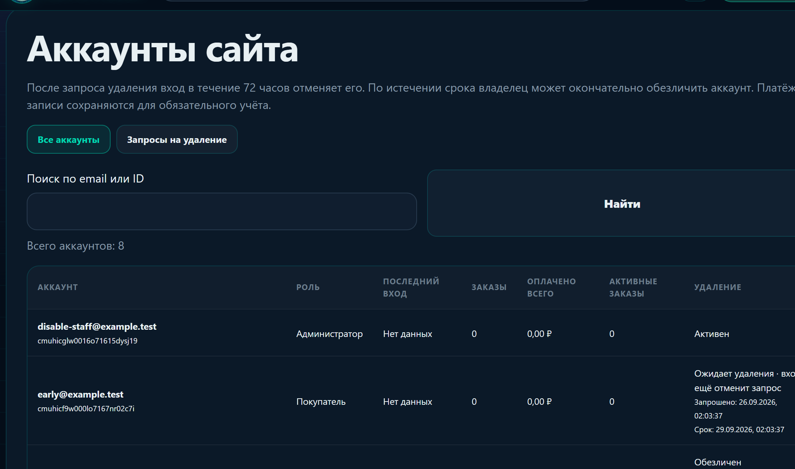
1. Ищите по email или ID и нажмите «Найти».
2. Проверьте роль, последний вход, число заказов, оплачено всего, активные заказы и столбец «Контроль покупок». Метка «3+ игровых аккаунта за 90 дней» отличается от блокировки покупок.
3. Для запросов на удаление перейдите во вторую вкладку.

#### Запросы на удаление

После запроса пользователя повторный вход в течение 72 часов отменяет удаление.

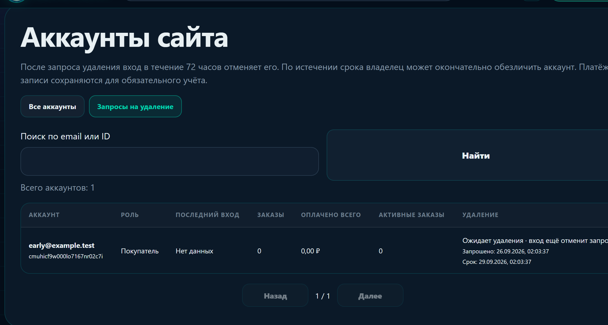
1. Откройте «Запросы на удаление» и проверьте срок в строке.
2. После истечения срока уполномоченный сотрудник с правом изменения аккаунтов может окончательно обезличить аккаунт с паролем и 2FA. Нельзя удалить аккаунт с правами выше собственных; владельца может удалить только другой владелец, последнего владельца удалить нельзя.
3. Платёжные записи сохраняются для обязательного учёта; на снимке удаление не запускалось.

#### Подтверждение удаления аккаунта

Форма показана на синтетическом запросе с истёкшим сроком; срок смоделирован только в браузере.

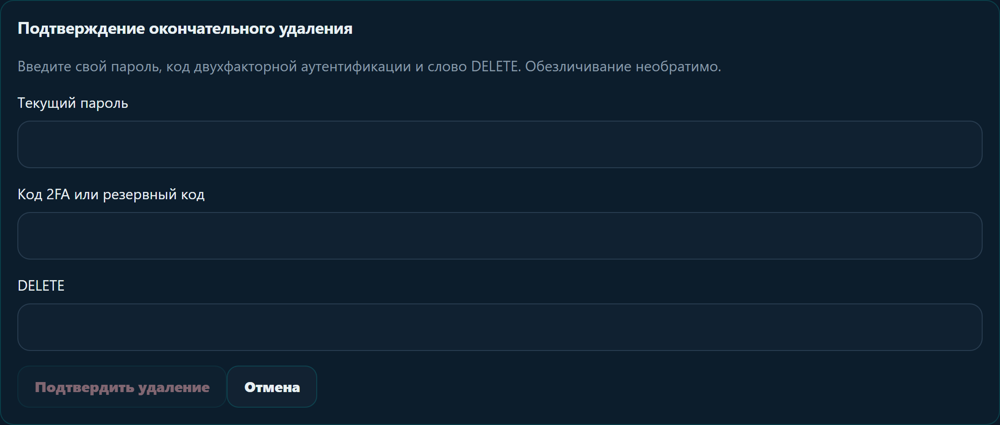
1. Откройте «Окончательно удалить» только после 72 часов и при отсутствии активных заказов.
2. Введите свой текущий пароль и код 2FA или резервный код. Нажмите «Подтвердить удаление» и подтвердите необратимость в диалоге браузера. Слово DELETE передаёт интерфейс; отдельного поля для его ввода в текущей форме нет.
3. Окончательное обезличивание необратимо; при подготовке снимка форма не отправлялась.

### Сотрудники

#### Список сотрудников

Владелец управляет приглашёнными аккаунтами и административными каналами.

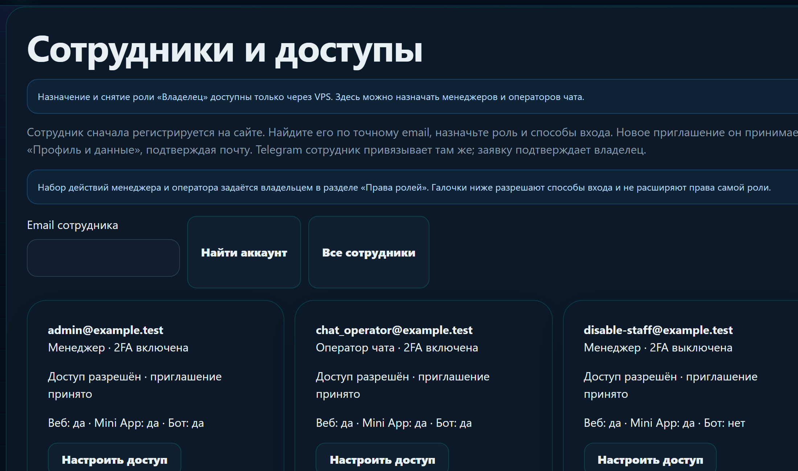
1. Найдите сотрудника в списке и проверьте состояние доступа.
2. Откройте «Настроить доступ» для роли и каналов.
3. Роль определяет права разделов; выключенный общий допуск блокирует все каналы.

#### Редактор доступа сотрудника

Веб-админка, Mini App и команды бота включаются отдельно.

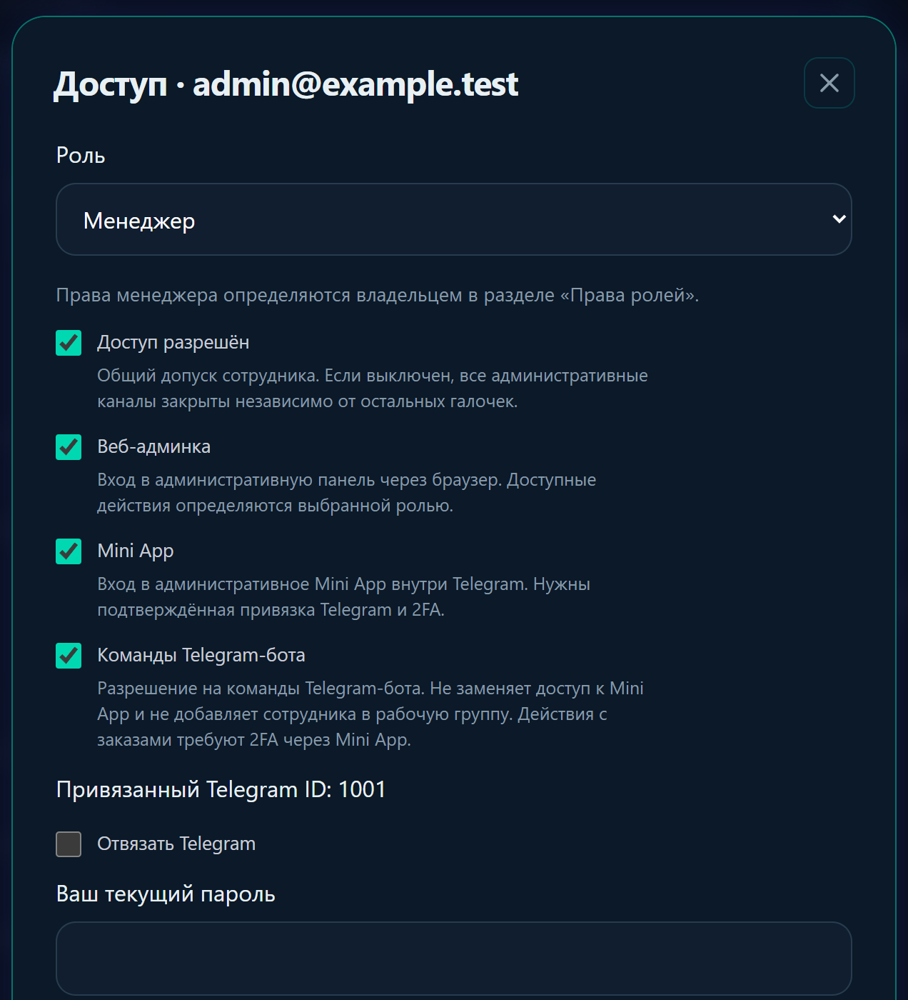
1. Выберите роль, проверьте галочку общего допуска.
2. Включите только необходимые каналы: веб, Mini App, Telegram-бот.
3. Для Mini App нужны подтверждённая привязка Telegram и 2FA; сохранение требует текущий пароль владельца.

### Права ролей

#### Матрица прав

Роль менеджера и оператора чата можно настроить по каждому разделу и действию.

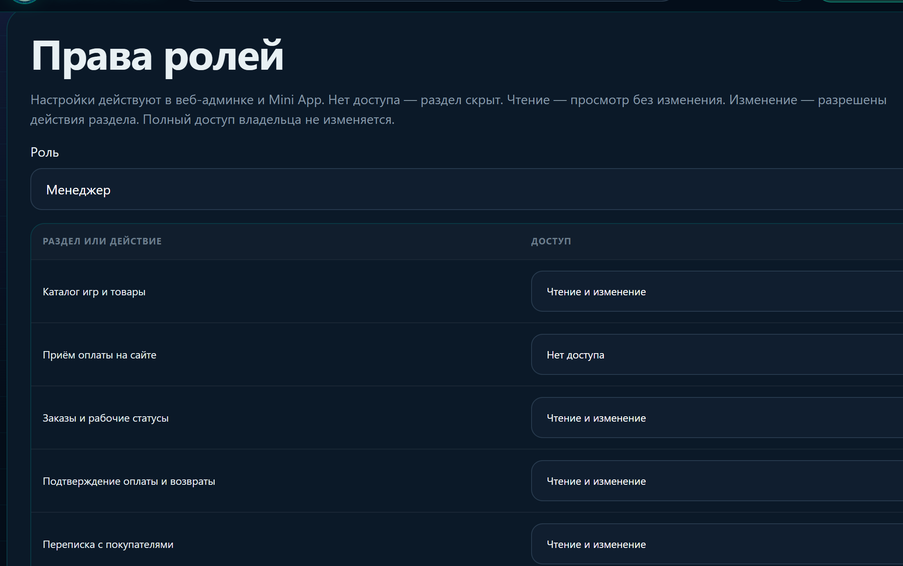
1. Выберите роль и для каждой строки выберите доступный уровень: «Нет доступа», «Только чтение», а для изменяемых разделов — «Чтение и изменение». Для UID/логинов, игровых паролей и аудита предусмотрены только отсутствие доступа или чтение.
2. Отдельно проверьте заказы, оплату, чат, идентификаторы, пароли и удаление.
3. Сохраните изменения; права действуют и в веб-админке, и в Mini App. Полный доступ владельца не меняется.

### Профиль

#### Безопасность и 2FA

Для административного доступа двухфакторная аутентификация обязательна.

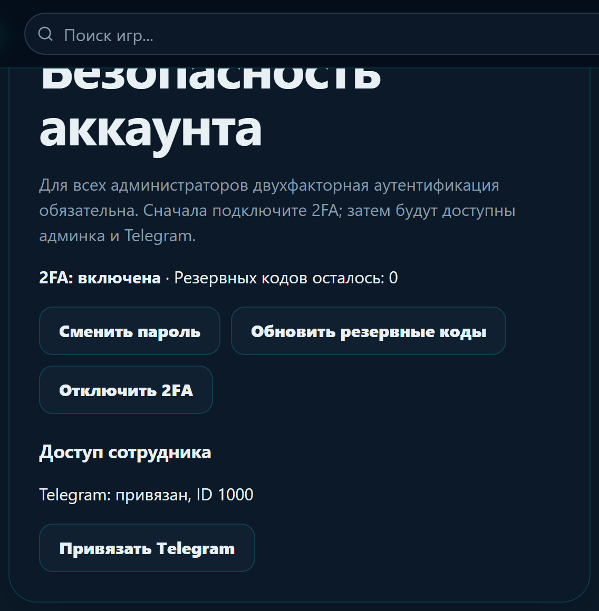
1. Подключите TOTP в приложении, подтвердите код и сохраните одноразовые резервные коды.
2. При смене пароля укажите текущий пароль, новый пароль и подтверждение; при включённой 2FA нужен второй фактор, иначе код из письма. Для обновления резервных кодов нужны текущий пароль и второй фактор.
3. Для отключения 2FA нужны текущий пароль и код из письма, а не код приложения. Завершатся все сессии и перестанут действовать резервные коды; доступ в админку и Telegram возобновится после нового подключения 2FA.
4. Примите приглашение сотрудника в этом блоке, затем подключите Telegram. Одноразовая ссылка «Вступить в GSProAdmins» действует 10 минут: отправьте заявку; бот обработает её, затем владелец подтверждает Telegram ID сотрудника. Если уже состоите в группе, используйте ссылку подтверждения через бота.

#### Подтверждение действия 2FA

Для изменения резервных кодов требуется пароль и действующий второй фактор.

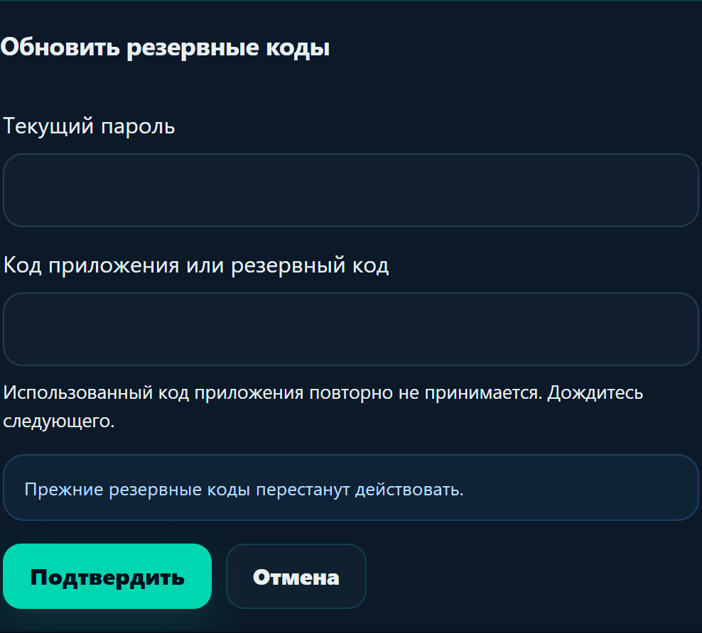
1. Нажмите «Обновить резервные коды» в блоке безопасности.
2. Введите текущий пароль и новый код приложения или резервный код.
3. Старые резервные коды после подтверждения перестанут действовать; на снимке форма не отправлялась.

#### Письма о заказах и чате

Сотрудник может управлять своей подпиской на служебные письма.

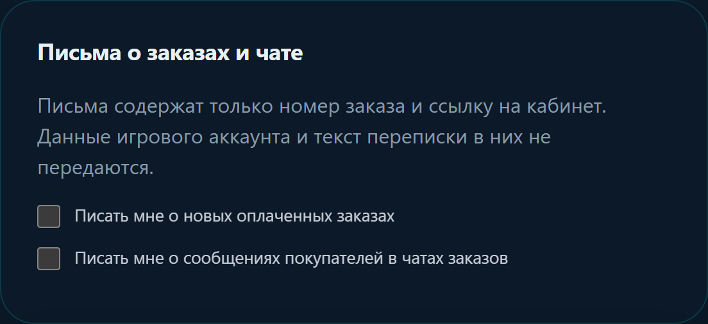
1. Включите нужные уведомления о оплаченных заказах и сообщениях покупателей.
2. Доступность галочек зависит от прав роли на заказы и чат.
3. Личные настройки не меняют доступ к самим заказам.

#### Отчёты о резервном копировании

Владелец может получать письма об успешных копиях и ошибках.

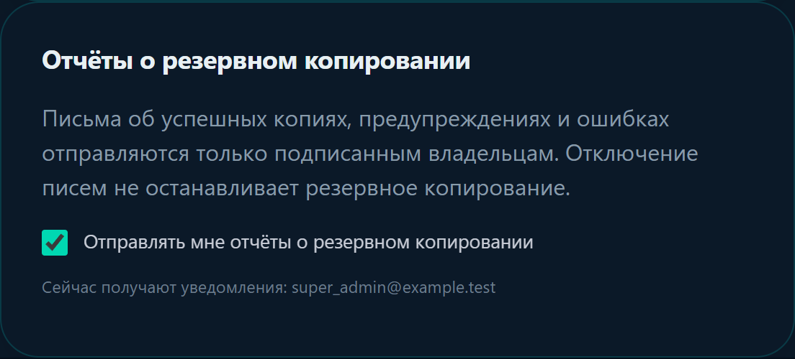
1. Отметьте «Отправлять мне отчёты о резервном копировании».
2. Под списком указаны подписанные владельцы.
3. Отключение писем не останавливает резервное копирование.

### Mini App

#### Навигация Mini App

Мини-админка открывается внутри Telegram после привязки и проверки доступа.

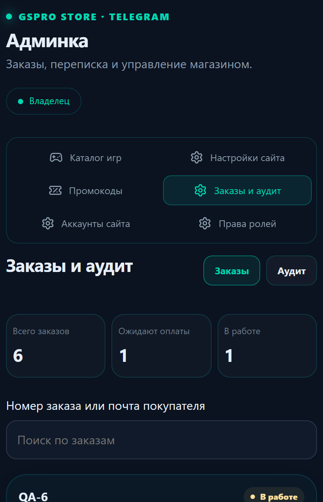
1. Выберите нужный раздел в компактной сетке; видимые пункты зависят от роли.
2. Индикатор роли расположен рядом с заголовком.
3. Если закреплённая кнопка Telegram не показана на iPhone, используйте кнопку меню бота.

#### Заказы на телефоне

Карточки заказов заменяют широкую настольную таблицу.

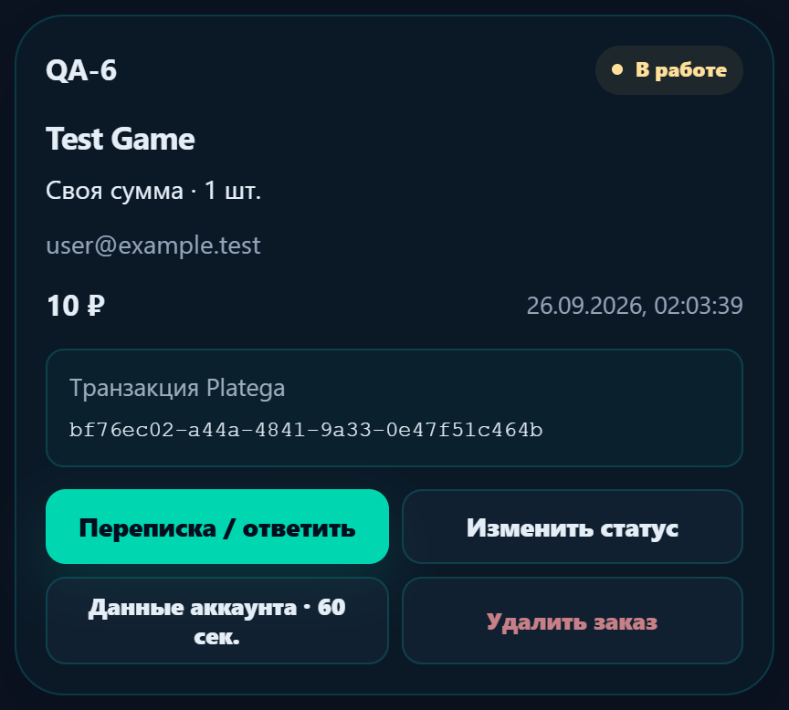
1. Прокрутите список заказов вертикально и откройте нужную карточку.
2. Статус, переписка и данные аккаунта доступны в пределах тех же прав роли.
3. Для длительной работы с таблицами удобнее веб-админка.

#### Ответ из Mini App

Мобильное модальное окно использует ту же переписку заказа.

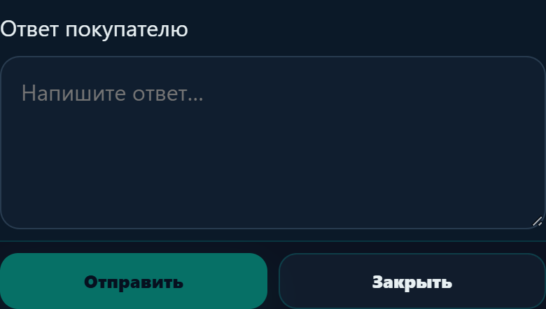
1. Откройте «Переписка / ответить» в карточке.
2. Прокрутите историю и отправьте сообщение.
3. После ответа проверьте появление сообщения в истории.

#### Раскрытие и копирование данных

Мини-админка показывает разрешённые поля на короткое время.

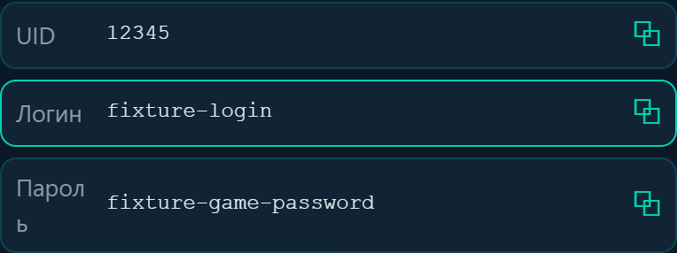
1. Откройте «Данные аккаунта» у нужного заказа.
2. Нажмите UID, логин или пароль для копирования одного поля.
3. Пароль доступен только при отдельном праве просмотра игровых паролей; у оператора чата его нет по умолчанию. После выполнения заказа пароль удаляется.

#### Каталог в Mini App

Игры и товары доступны в компактном мобильном представлении.

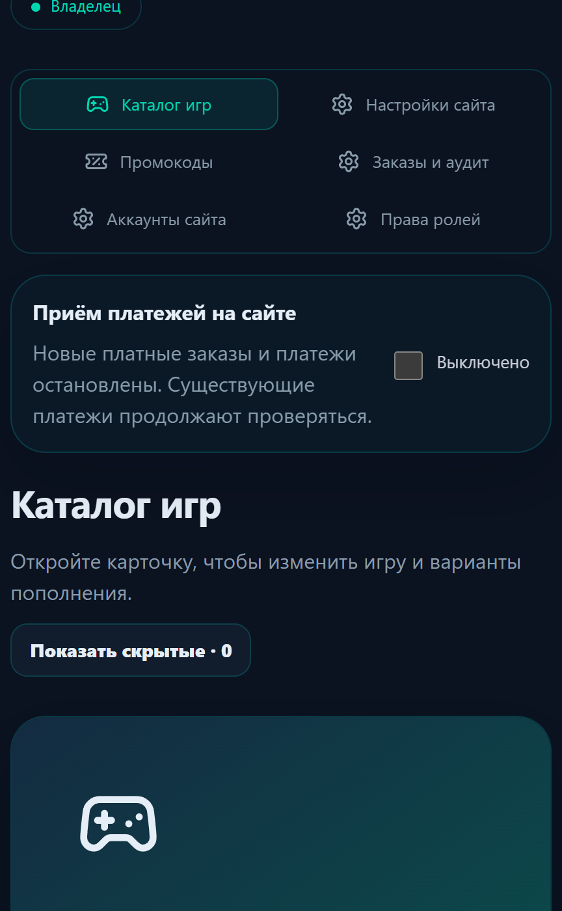
1. Перейдите в «Каталог игр» через сетку навигации.
2. Откройте карточку для изменения разрешённых полей.
3. Проверяйте итоговый вид публичной страницы после сохранения.

#### Настройки в Mini App

Настройки сайта сгруппированы так же, как в веб-админке.

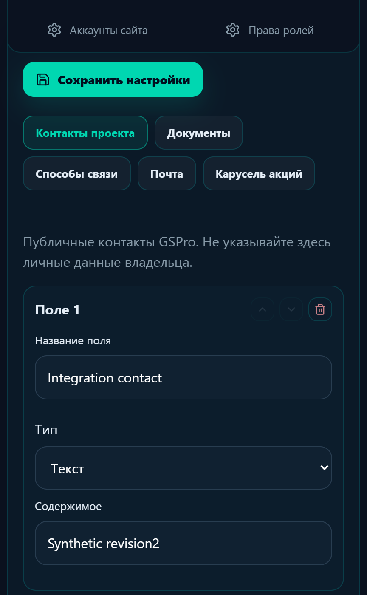
1. Переключайте вкладки контактов, документов, связи, почты и слайдов.
2. На маленьком экране прокручивайте длинные формы вертикально.
3. Сохраняйте соответствующую вкладку после правок.

#### Права ролей в Mini App

Матрица прав использует тот же серверный набор разрешений.

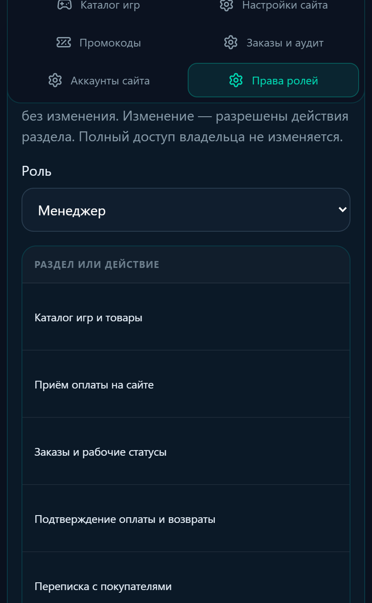
1. Владелец выбирает роль и меняет уровни доступа.
2. Горизонтально прокручивайте таблицу, чтобы увидеть столбец выбора на узком экране.
3. После сохранения права применяются к обоим интерфейсам. В Mini App нет отдельного окна управления сотрудниками: используйте веб-админку.

## 10. Новые действия обновления от 27.09.2026

Пункты этого раздела повторно сверены с файлами установленного обновления на VPS 27.09.2026: отмена удаления аккаунта и удаление игры присутствуют в веб-админке и Mini App. Если осталась ранее открытая страница, обновите её. Доступность действий зависит от прав.

### Отменить запрос удаления аккаунта

1. Откройте «Аккаунты сайта» -> «Запросы на удаление» и найдите нужного пользователя.
2. Проверьте email, ID и состояние. Действие доступно для незавершённого запроса и во время 72 часов, и после истечения срока; необратимо обезличенный аккаунт оно не восстанавливает.
3. При праве изменения аккаунтов нажмите «Отменить удаление». Отдельный код 2FA для этой кнопки не запрашивается; сама административная сессия должна иметь необходимый допуск.
4. Дождитесь сообщения «Удаление отменено. Пользователь может снова войти в аккаунт» и обновления строки. Ошибка означает, что отмена не выполнена.
5. История, роли и действующие ограничения покупок сохраняются; отмена записывается в аудит. Пользователь сможет войти при соблюдении остальных условий доступа. Восстановление прежней браузерной сессии не происходит.

### Удалить игру из двух каталогов

1. В «Каталоге игр» откройте сохранённую игру и найдите действие «Удалить игру». Оно требует права изменения каталога.
2. Проверьте название в подтверждении: игра исчезнет из каталога администрации и каталога покупателей.
3. Введите свой код 2FA либо одноразовый резервный код в видимое поле и нажмите «Подтвердить удаление игры». «Отмена» закрывает форму без удаления.
4. При неверном коде или ошибке игра остаётся. Дождитесь успешного обновления списка и проверьте публичный каталог.
5. Заказы, переписка и аудит сохраняются. Это удаление из каталогов с сохранением исторической записи; оно не возвращает платежи и не удаляет старые заказы.
6. Новые заказы и повторное сохранение удалённой игры через старую открытую страницу блокируются. «Показать скрытые» не возвращает удалённую игру; отдельной кнопки восстановления этого удаления в проверенном интерфейсе нет.

## 11. Проверка после изменений

После сохранения каталога, публичных контактов, документов и слайдов откройте соответствующую страницу сайта. После изменения прав проверьте доступ под нужной ролью. Для платежей проверьте доступность провайдера, прежде чем включать новые оплаты. Статус заказа и возврат средств - разные операции: изменение статуса в GSPro не отправляет возврат платёжному провайдеру.

## 12. Версия и проверка

При переводе заказа в «Выполнен» игровой пароль удаляется из рабочей базы. Удаление заказа необратимо убирает его вместе с перепиской и отзывом, но не возвращает деньги. Окончательное обезличивание аккаунта доступно уполномоченному сотруднику с правом изменения аккаунтов после срока ожидания и дополнительного подтверждения; действуют ограничения по правам целевого аккаунта и защита последнего владельца. Для 2FA храните резервные коды отдельно от пароля. Письма о резервных копиях и сами копии управляются раздельно.

Снимки показывают интерфейс на дату редакции; состав вкладок зависит от выданных прав и может отличаться для отдельных сотрудников.

Исходный GitHub commit для этой редакции: `053935824875a129648d7545625d800b80605d2a`. Снимок исходников VPS прочитан 27.09.2026; файл VERSION в нём: `footer-note-20260927-01a0e21b`. VERSION сам по себе не доказывает включение каждой последующей правки в работающие образы. В этой работе не выполнялись реальные платежи, отправка писем, удаление покупателей и изменение настроек сайта. Полная проверка интерфейса под всеми ролями на реальных устройствах не проводилась.

После завершения параллельного выпуска выполнено повторное чтение файлов VPS: подтверждено наличие отмены удаления аккаунта и удаления игры с 2FA в веб-админке и Mini App. Эти действия описаны в разделе 10. Сам файл VERSION остался прежним, поэтому он не используется как единственное доказательство состава обновления.
