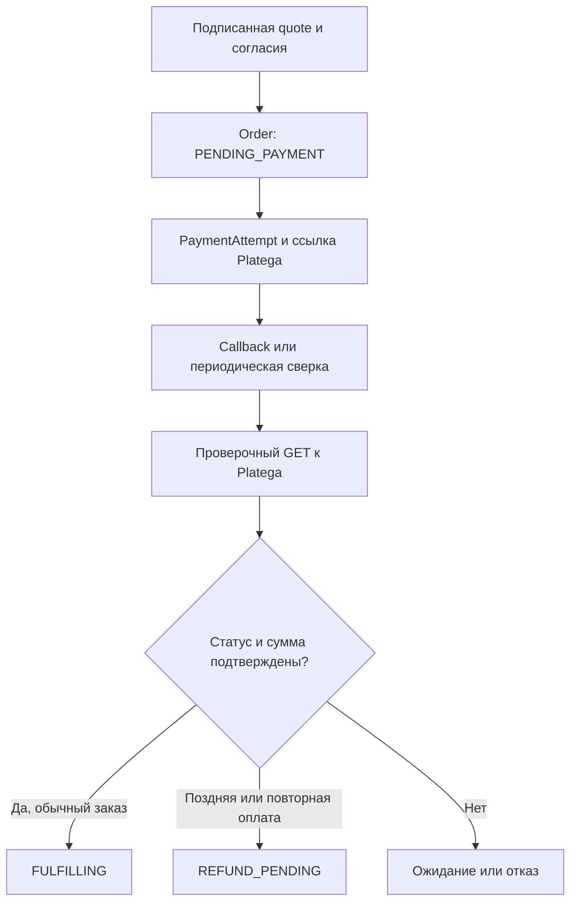

# Platega и состояние оплаты

Карта исходников: 28.09.2026.

Новые платные заказы разрешены при включённой галочке «Приём платежей на сайте» (`TechnicalSettings.checkoutEnabled`) и корректной конфигурации провайдера. Изменение требует `checkout.write` и 2FA, записывается в аудит. Один комплект приложения сохраняет `DEPLOY_MODE=production`; галочка не меняет образы. `PLATEGA_ENABLED` задаёт исходное значение до настройки БД. Аутентифицированные callback и сверка уже созданных оплат продолжаются при закрытии новых продаж. Заказ с полной скидкой может пройти без оплаты.

## Жизненный цикл

Callback служит сигналом для проверочного GET. Проверяются транзакция, payload, merchant, сумма и валюта; обработка идемпотентна. Блокировки согласуют создание попытки, отмену и подтверждение оплаты.

`REFUNDED` в административном интерфейсе - учётный статус. Он не означает, что код отправил возврат провайдеру. Для фактического возврата нужна подтверждённая процедура.

Архивный промокод не участвует в новом оформлении, но его запись и связь с историческим заказом сохраняются.

Исходники: `app/lib/platega-service.js`, `platega.js`, `platega-amounts.js`, `payment-availability.js`, `promos.js`, `app/scripts/platega-reconcile.mjs`.
