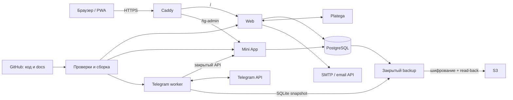
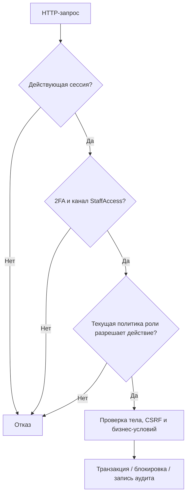
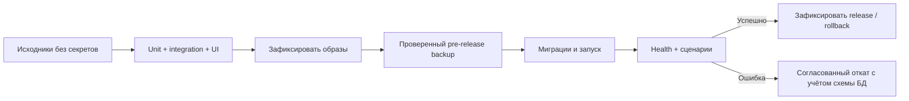

# Потоки GSPro

Актуальность: 26.09.2026. Схемы дополняют карточки и не содержат credentials.

## Компоненты

```mermaid
flowchart LR
 U[Браузер / PWA] -->|HTTPS| C[Caddy]
 C -->|/| W[Web]
 C -->|/tg-admin| M[Mini App]
 W --> D[(PostgreSQL)]
 M --> D
 B[Telegram worker] -->|закрытый API| M
 B <--> T[Telegram API]
 W <--> P[Platega]
 W --> E[SMTP / email API]
 D --> K[Закрытый backup]
 B -->|SQLite snapshot| K
 K -->|шифрование + read-back| S[S3]
 G[GitHub: код и docs] --> R[Проверки и сборка]
 R --> W
 R --> M
 R --> B
```

## Серверное разрешение операции

```mermaid
flowchart TD
 A[HTTP-запрос] --> B{Действующая сессия?}
 B -->|Нет| X[Отказ]
 B -->|Да| C{2FA и канал StaffAccess?}
 C -->|Нет| X
 C -->|Да| D{Текущая политика роли разрешает действие?}
 D -->|Нет| X
 D -->|Да| E[Проверка тела, CSRF и бизнес-условий]
 E --> F[Транзакция / блокировка / запись аудита]
```

## Выпуск и проверка

```mermaid
flowchart LR
 A[Исходники без секретов] --> B[Unit + integration + UI]
 B --> C[Зафиксировать образы]
 C --> D[Проверенный pre-release backup]
 D --> E[Миграции и запуск]
 E --> F[Health + сценарии]
 F -->|Успешно| G[Зафиксировать release / rollback]
 F -->|Ошибка| H[Согласованный откат с учётом схемы БД]
```
